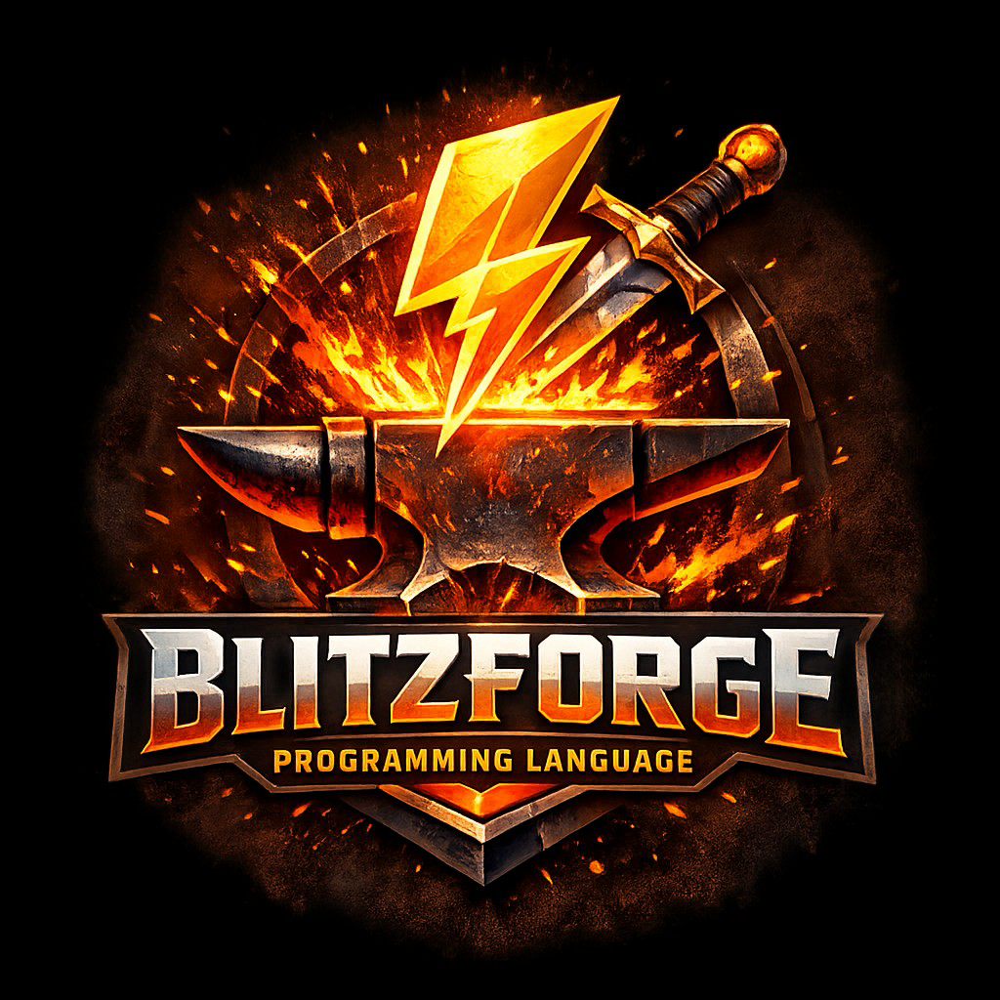

<div align="center">



# BlitzForge

### Blitz3D, modernized.

**An open-source, cross-platform compiler and runtime for the Blitz programming language** — keeping a generation of games and tools alive while moving them onto modern hardware.

---

[](https://github.com/RydeTec/blitz-forge/actions/workflows/ci.yml)
[](https://github.com/RydeTec/blitz-forge/actions/workflows/static-analysis.yml)
[](https://github.com/RydeTec/blitz-forge/releases/latest)
[](https://github.com/RydeTec/blitz-forge/stargazers)
[](https://github.com/RydeTec/blitz-forge/issues)
[](https://github.com/RydeTec/blitz-forge/pulls)
[](https://github.com/RydeTec/blitz-forge/commits/develop)
[](https://github.com/RydeTec/blitz-forge/discussions)

[](#install)
[-orange?logo=apple&logoColor=white)](#macos-apple-silicon--alpha)
[](#build-from-source)
[](#build-from-source)

</div>

<p align="center">
  <a href="https://github.com/RydeTec/blitz-forge/releases/latest"><b>Download</b></a> ·
  <a href="#quick-start"><b>Quick Start</b></a> ·
  <a href="help"><b>Language Reference</b></a> ·
  <a href="samples"><b>Samples</b></a> ·
  <a href="https://github.com/RydeTec/blitz-forge/discussions"><b>Discussions</b></a> ·
  <a href="#contribute"><b>Contribute</b></a>
</p>

---

## Why BlitzForge

Blitz3D and BlitzBasic shaped a generation of indie game development. The original toolchain was tied to 32-bit Windows, closed-source, and frozen. BlitzForge is the alternative:

- **Open source.** MIT-style community development, public CI, no surprise binaries.
- **Cross-platform foundations.** Native Windows x86_64 is the stable target today. A macOS Apple Silicon (arm64) port is in **alpha** — same source tree, ARM64 codegen, Cocoa runtime backend — but not yet ready to ship games on. See [macOS (Apple Silicon) — alpha](#macos-apple-silicon--alpha) below.
- **Modern build system.** CMake + Ninja, optional static analysis, GitHub Actions CI on every push.
- **Drop-in compatible.** Existing `.bb` source compiles. Existing `.decls` userlibs work. We do not break your games.
- **Production-tested.** Powers [RealmCrafter: Community Edition](https://github.com/RydeTec/rcce2) and the games built on top of it.

| | Original Blitz3D | BlitzForge |
|---|---|---|
| License | Proprietary | **Open source** |
| Source | Closed | **Public** |
| Platforms | Windows 32-bit | **Windows x86_64 (stable) + macOS arm64 (alpha)** |
| Build system | Custom / VS6-era | **CMake + Ninja** |
| Codegen targets | x86 only | **x86 + ARM64** |
| CI | None | **GitHub Actions: build, test, lint** |
| Dev tooling | Built-in IDE only | **VS Code extension + native IDEs** |
| Maintenance | Frozen | **Active** |

## Features

- **`blitzcc`** — the BlitzBasic compiler, producing native executables.
- **Two code generators** — `codegen_x86` and `codegen_arm64`, sharing a common assembler abstraction.
- **Native runtime** — `runtime.dylib` / `runtime.dll` providing the standard Blitz library surface (graphics, audio, input, filesystem, sockets, etc.).
- **Linker** — `linker.dylib` / `linker.dll` for producing standalone executables.
- **Userlib system** — load existing `.decls` + DLL/dylib pairs unchanged.
- **macOS backend** — a Cocoa/Objective-C++ runtime backend (`macos_runtime_backend.mm`) provides the Win32 surface that legacy modules expect.
- **Tests + CI** — a Blitz-language test suite under [`tests/`](tests) runs on every commit and on every PR.

## Install

Download a pre-built release for your platform from [**Releases**](https://github.com/RydeTec/blitz-forge/releases/latest).

| Platform | Artifact | Status |
|---|---|---|
| Windows x86_64 | `blitzforge-windows-x64.zip` | Stable |
| macOS arm64 | `blitzforge-macos-arm64.zip` | **Alpha — not for production use** |

Each release ships:

```
bin/
├── blitzcc           # the compiler
├── runtime.{dll,dylib}
├── linker.{dll,dylib}
└── OpenAL32.dll      # vendored audio runtime (Windows-style name preserved cross-platform)
```

Add `bin/` to your `PATH` and you're done.

## Quick start

```basic
; hello.bb
Print "Hello from BlitzForge!"
WaitKey
End
```

```bash
blitzcc -o hello hello.bb
./hello
```

For graphical samples, see [`samples/`](samples) and [`games/`](games).

## Build from source

### Prerequisites

| Tool | Windows | macOS |
|---|---|---|
| C++17 compiler | MSVC 2019+ (Build Tools or Visual Studio Community) | Xcode Command Line Tools |
| CMake | ≥ 3.20 | ≥ 3.20 |
| Ninja | ✓ | ✓ |
| Node.js (for VS Code extension) | 22.10.0 (via `nvm`) | 22.10.0 (via `nvm`) |

### Windows

```bat
git clone https://github.com/RydeTec/blitz-forge.git
cd blitz-forge
compile.bat
test.bat
publish.bat
```

### macOS (Apple Silicon) — alpha

> **Status: alpha. Not stable. Expect breakage.**
>
> Native macOS arm64 support is under active development. The compiler (`blitzcc`) builds and can target `macos-arm64`, but the runtime execution path is incomplete and many language and standard-library features are not yet wired up. **Do not rely on it for shipping work.** Issues and feedback specific to the macOS port are welcome on the [issue tracker](https://github.com/RydeTec/blitz-forge/issues).

```bash
git clone https://github.com/RydeTec/blitz-forge.git
cd blitz-forge
./scripts/bootstrap_macos.sh    # one-time: installs cmake/ninja/llvm and runtime deps via Homebrew
./compile.sh                    # builds bin/blitzcc, bin/runtime.dylib, bin/linker.dylib
./test.sh                       # runs tests/*.bb against -target macos-arm64
./publish.sh                    # produce a redistributable archive
```

Build artifacts land in [`bin/`](bin) and a redistributable archive in `release/`.

## Repository layout

```
BlitzForge/
├── src/blitzrc/
│   ├── blitz/             # entry point, libs, frontend glue
│   ├── compiler/          # parser, AST, type system, semantic analysis
│   │   ├── codegen_x86/   # x86 backend (legacy + 64-bit)
│   │   └── codegen_arm64/ # macOS / Apple Silicon backend
│   ├── bbruntime/         # standard library implementation
│   ├── bbruntime_dll/     # runtime DLL/dylib glue
│   ├── linker/            # link step
│   ├── linker_dll/        # linker DLL/dylib glue
│   ├── gxruntime/         # Windows graphics/audio/input runtime
│   ├── debugger/          # debug protocol
│   └── stdutil/           # cross-platform utility layer
├── tests/                 # Blitz-language test suite (runs on every commit)
├── samples/ · games/      # example programs
├── help/                  # language reference and command docs
├── tutorials/             # learning material
├── userlibs/              # bundled .decls + DLL/dylib pairs
├── cfg/                   # IDE / editor configuration
├── scripts/               # cross-platform build helpers
└── bin/                   # compiled output
```

## CI and quality

Every push and every pull request runs:

- **Build + test** ([`ci.yml`](.github/workflows/ci.yml)) — compiles `blitzcc` and runs the Blitz test suite.
- **Workflow lint** ([`static-analysis.yml`](.github/workflows/static-analysis.yml)) — `yamllint` and `actionlint` for GitHub Actions hygiene.

The full test suite also runs as a local pre-commit hook. **Tests must pass to commit.**

## Documentation

- **[Language reference](help)** — every built-in command, organized by module.
- **[Tutorials](tutorials)** — guided walkthroughs.
- **[Samples](samples)** and **[Games](games)** — runnable example projects.
- **[VS Code extension](https://github.com/RydeTec/vscode-blitz-forge)** — syntax highlighting, build, debug, test.

## Contribute

| You are a... | You can... | Start here |
|---|---|---|
| **Blitz user** | File bugs, request features, write tutorials | [Issues](https://github.com/RydeTec/blitz-forge/issues) · [Ideas](https://github.com/RydeTec/blitz-forge/discussions/categories/ideas) |
| **Blitz developer** | Improve the standard library and samples | [`samples/`](samples) · [`tests/`](tests) |
| **C++ developer** | Improve the compiler, codegen, or runtime | [`src/blitzrc/`](src/blitzrc) |
| **Tooling enthusiast** | Improve CI, build scripts, packaging | [`scripts/`](scripts) · [`.github/workflows/`](.github/workflows) |
| **Writer** | Improve docs, examples, onboarding | [`help/`](help) · [`tutorials/`](tutorials) |

### Workflow

1. Fork or clone; branch from `develop`.
2. Add or update tests in [`tests/`](tests) for any behavior change.
3. Run `compile.bat` / `compile.sh` and `test.bat` / `test.sh` locally.
4. Open a PR targeting `develop`. Releases are PRs from `develop` → `master`.
5. CI must be green.

For push access, request to join the [**RCCE Contributors team**](https://github.com/orgs/RydeTec/teams/rcce-contributors).

### Coding standards

- **C++17**, no exotic compiler extensions.
- Keep the codegen backends behind the `assem.h` abstraction — don't leak ISA-specific assumptions into the front end.
- Prefer adding tests over adding comments.
- One purpose per commit.

## Community

- **GitHub Discussions** — [github.com/RydeTec/blitz-forge/discussions](https://github.com/RydeTec/blitz-forge/discussions)
- **Issues** — [github.com/RydeTec/blitz-forge/issues](https://github.com/RydeTec/blitz-forge/issues)
- **Discord** — invite link is available from the **RCCE Project Manager** in the [parent repo](https://github.com/RydeTec/rcce2)

## Used by

- **[RealmCrafter: Community Edition](https://github.com/RydeTec/rcce2)** — open-source MMORPG engine
- *Building something on BlitzForge?* Open a PR adding it here.

## Heritage

BlitzForge is a respectful continuation of the work of Mark Sibly and the original Blitz Research team, and stands on a long lineage of community ports, patches, and re-implementations. We aim to preserve compatibility with existing Blitz code while bringing the toolchain into the modern era.

## License

BlitzForge is community-developed and openly available. Subsystems vendored from third parties retain their original licenses (see in-tree headers and `LICENSE` files where present). For questions about reuse, redistribution, or commercial use, please open a [Discussion](https://github.com/RydeTec/blitz-forge/discussions) or contact the maintainers.

---

<div align="center">

**Compile fearlessly. Ship anywhere.**

[Download](https://github.com/RydeTec/blitz-forge/releases/latest) · [Star the repo](https://github.com/RydeTec/blitz-forge) · [Join the discussion](https://github.com/RydeTec/blitz-forge/discussions)

</div>
